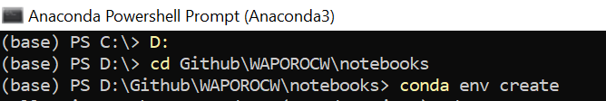
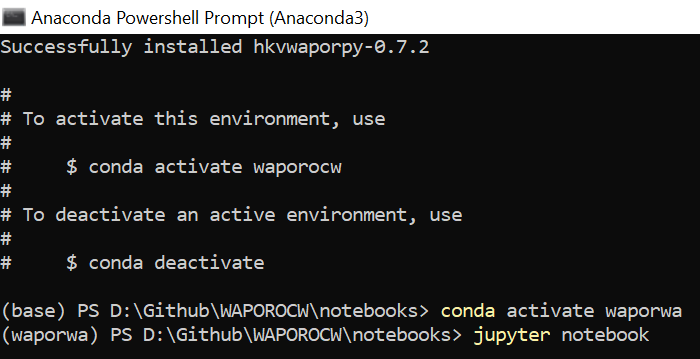

# Jupyter notebooks for 'Water Productivity and Water Accounting using WaPOR' open courseware

## [See the full course on IHE Delft OpenCourseWare](https://ocw.un-ihe.org/course/view.php?id=92&section=0)

Authors: Bich Tran, Abebe Chukalla, Solomon Seyoum

<html>
  <head>
     This work is licensed under a <a rel="license" href="http://creativecommons.org/licenses/by-nc-sa/4.0/">Creative Commons Attribution-NonCommercial-ShareAlike 4.0 International License</a>
  </head>
</html>

## Contents

### Module 1: Introduction and Usage

- Unit 4 WaPOR spatial data analysis using Python packages
    * Download WaPOR raster data
    * Clip and resample
    * Raster calculation
- Unit 5 WaPOR API
    * Get catalog and available data table
    * Get point and area time-series
    * Get raster and crop raster
    * Get custom Water Productivity raster

### Set up Python environment

**You must do this the first time you open the Jupyter Notebooks**

**Step 1**: Download repository zipfile and unzip 

OR

Clone in Git Bash ([Git](https://git-scm.com/) needs to be installed)

    >>> git clone https://github.com/wateraccounting/WAPOROCW.git

**Step 2**: Open Anaconda prompt, change directory to folder **..\WAPOROCW-master**

    >>> cd ..PATH..\WAPOROCW-master\
    
**Step 3**: Create a new environment from environment.yml file

    >>> conda env create
    

### Start Jupyter Notebook

**Step 1**: Change directory to folder **..\WAPOROCW-master\notebooks**

    >>> cd ..PATH..\WAPOROCW-master\notebooks
 
**Step 2**: Then activate environment with required packages

    >>> conda activate waporocw
  
**Step 3**: Start jupyter notebook

    >>> jupyter notebook
    

